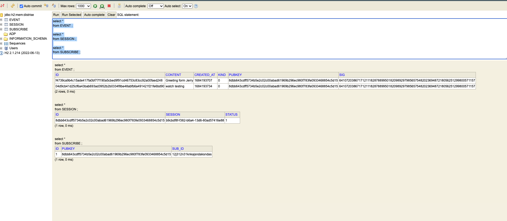

# Distrise
It's a simple project to learn about Distributed Systems from [RISE Program](https://rise.alphacamp.co/), and will
build a Peer-to-Pear system via [Nost](https://nostr.com/) protocol.

> Nostr is a simple, open protocol that enables global, decentralized, and censorship-resistant social media.

Actually, I'm not really understand the [NIPs](https://nostr.com/the-protocol/nips), I'm just walking and staggering.

## Required
* JDK17
* Gradle

## Modules
* [nostr-core](./nostr-core/) - Nostr protocol core.
* [nostr-example](./nostr-example) - A simple Nostr Client connect to Relay, only support NIP-01.
* [nostr-spring](./nostr-spring) - Integrated Nostr Relay to Spring boot.
  * Support H2 database, used in develop.
  * Support [Cockroach database](https://www.cockroachlabs.com/docs/v22.2/build-a-spring-app-with-cockroachdb-jpa) 
    used in UAT.
  
## DOCKER  
[docker](./docker) - You can host the single cockroachDB on local.

## Why did I choose this database?
I would consider using Cockroach DB as a database for Nostr, as Cockroach supports a cluster approach (3 quorums), which has a higher availability than traditional single-point databases.

When a quorum fails, one of the remaining replicas will get a range lease (with write capability) to ensure data consistency, and the CP feature is more suitable for Nostr's community platform.

## If the number of events to be stored will be huge, what would you do to scale the database?
I have roughly designed the table schema to support these functions

1. when a message comes in from NIP-01, Relay needs to verify the signature (Insert SESSION...)
2. need to record client session messages for broadcast (Insert EVENT...)
3. need to record which subscriptions the client has, for broadcast purposes (Insert SUBSCRIBE...)

The Event Table is the most likely to grow in a short time, and may need to be filtered for queries (where by 
conditionA and...). 

I'm not sure about the partitioning and sharding capabilities of Cockroach, 
but I would first consider sharding the data using time slicing, 
such as creating a table for events in the same month, or another table for data in the same year, 
but I'm not sure, but it might have to consider with the limitations of Relay.

## Others
1. Java is very hardcode to serialize and deserialize arbitrarily array object. I haven't found a good solution yet.
2. The signature verify still failed, I had difficulty finding the Schnorr secp256k1 signature in the java term. 
3. I forgot implement the NIP-11 