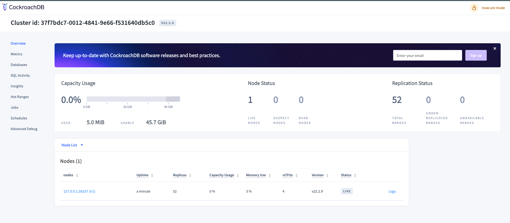

# Docker Compose

## Required
* Setup the docker
* Setup the docker-compose

## QuickStart
I just follow the cockroach page and writing the [docker-compose.yaml](./docker-compose.yaml) to quick run the sing 
node cockroachDB on local, it's run insecure (--insecure), so please don't run it on production environment.

```shell
# should docker login, than you can download the docker image
docker login
docker-compose up
```

Because with insecure, I got the error `ERROR: setting or updating a password is not supported in insecure mode`. it 
means the environment params of `USER_NAME`, `PASSWORD` didn't work.

So the connection is 
```
jdbc:postgresql://localhost:26257/distrise?sslmode=disable
```

### Spring boot with JPA
Follow the [nostr-spring](../nostr-spring/src/main/resources/application-cockroach.yaml).
```yaml
spring:
  datasource:
    url: jdbc:postgresql://localhost:26257/distrise?sslmode=disable
    username: root
    password:
```

### Cockroach web console
* open browser: http://localhost:8081


### docker-compose command ref
| Command                  | Description                                                      |
|--------------------------|------------------------------------------------------------------|
| `docker-compose`         | Docker-compose main command                                      |
| `docker-compose build`   | Build containers                                                 |
| `docker-compose exec`    | Execute command inside a container                               |
| `docker-compose ps`      | List containers                                                  |
| `docker-compose restart` | Restart container                                                |
| `docker-compose rm`      | Remove container                                                 |
| `docker-compose run`     | Run a command in container                                       |
| `docker-compose stop`    | Stop a container                                                 |
| `docker-compose up`      | Build, (re)create, start, and attach to containers for a service |
| `docker-compose up -d`   | Same as `dcup`, but starts as daemon                             |
| `docker-compose down`    | Stop and remove containers                                       |
| `docker-compose logs`    | Show logs of container                                           |
| `docker-compose logs -f` | Show logs and follow output                                      |
| `docker-compose pull`    | Pull image of a service                                          |
| `docker-compose start`   | Start a container                                                |