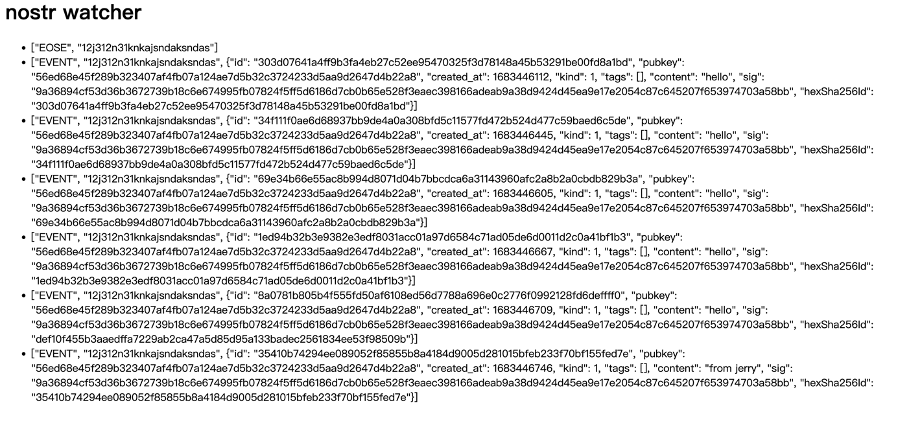

# Example

## Send Event

### What are some of the challenges you faced while working on Phase 1?
- [x] I learned how to used WebSocket client and also know how to build the server.
- [ ] but I not sure why my `Even.id` was diff from the Relay `hexSha256id`.
- [ ] and I sign the data very sloppy XD.
- [ ] the biggest challenge is that I don't really understand Crypto, so I try error many times and read a lot of 
  example code still has a bad learning.
- [ ] my goodness, I really wish a java dependency that would make me to do this easy.

### What kind of failures do you expect to a project such as DISTRISE to encounter?
- [ ] Pool performance, I don't know much about the performance of encryption and decryption, maybe it was done in a 
  bad way.
- [ ] Devops issue, I think a Relay instance it's hard to handle a lot of client's events, so there should be a 
  cluster of Relay. Probably a minimum of 3 Relays are required, and voting mechanism to determine the Master. Than 
  it will be face the CAP theory problems.
- [ ] I think I need more time to lean more, but the times never enough.

### Questions
- [ ] I think the websocket just like a MQ, why not used the MQ to build the Nostr protocol?