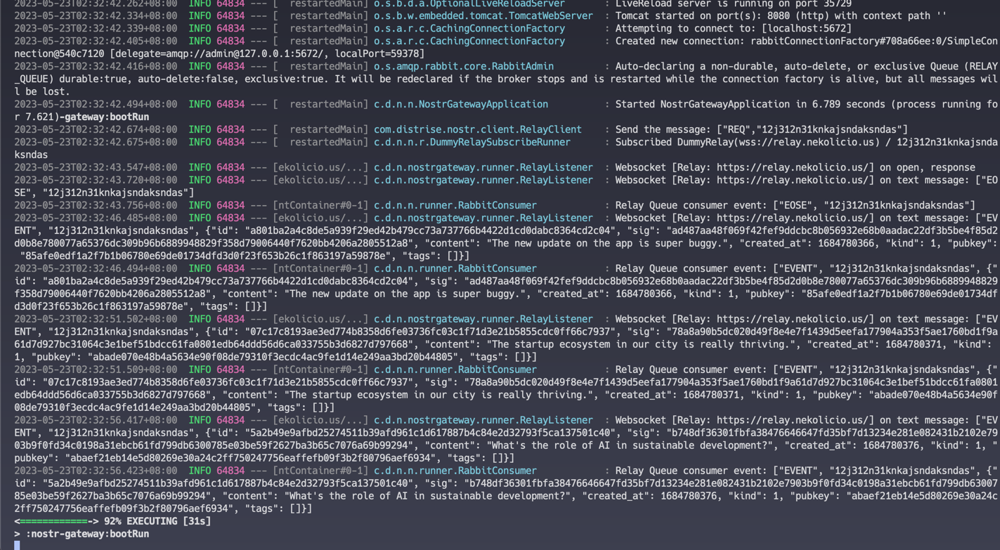
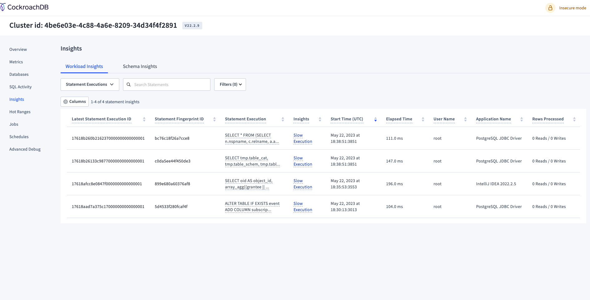
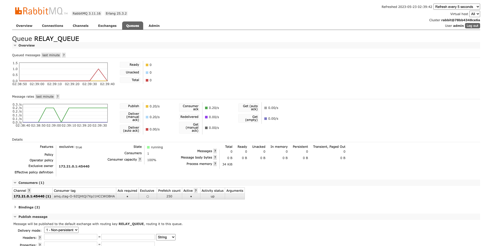
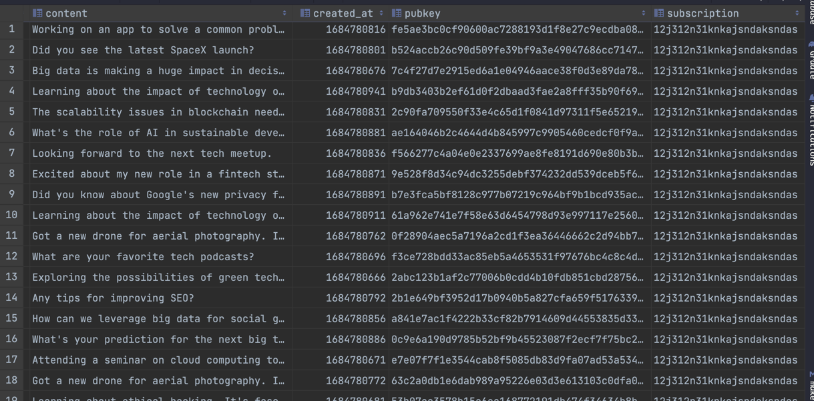

# Nostr-Gateway
The nostr-gateway work as Event Aggregator.

## Required
* JDK 17
* docker-compose

## QuickStart
Run up the Cockroach database and the RabbitMQ.
```shell
cd docker && docker-compose up
```

Run up the Spring boot
```shell
export SPRING_PROFILES_ACTIVE=cockroach,rabbitmq,relay

./gradlew :nostr-gateway:bootRun 
```

## Http Endpoint


## Demo





## Q&A
Please provide a short writeup of why you chose a particular database for Phase 3, answering the following questions:
* Why did you choose this database? Is it the same or different database as the one you used in Phase 2? Why is it 
the same or a different one?
* 
* If the number of events to be stored will be huge, what would you do to scale the database?